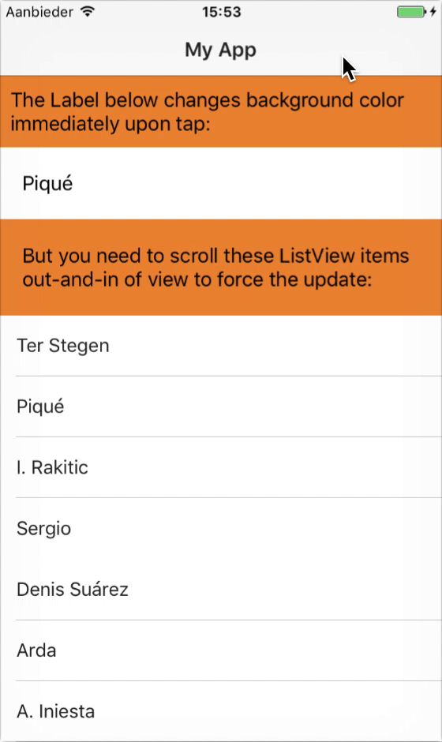
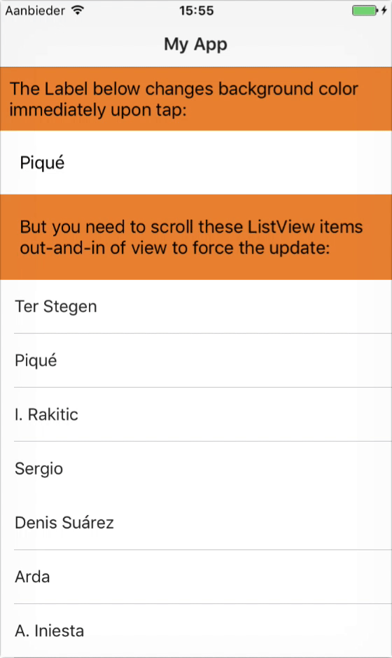

This repo reproduces [a NativeScript issue](https://github.com/NativeScript/NativeScript/issues/4489) (GIF on the left) where you need to scroll a ListView item out of view (and back in) to see the updated background color.

[The "fix" branch](https://github.com/EddyVerbruggen/nativescript-listview-backgroundcolor-changedetection-issue/tree/fix) (GIF on the right) suggests a fix that works for me but may not be the best solution.

   

```bash
git clone https://github.com/EddyVerbruggen/nativescript-listview-backgroundcolor-changedetection-issue
cd nativescript-listview-backgroundcolor-changedetection-issue
tns run ios
```

(I've checked in `node_modules` on purpose since that's where the problem/fix is)
